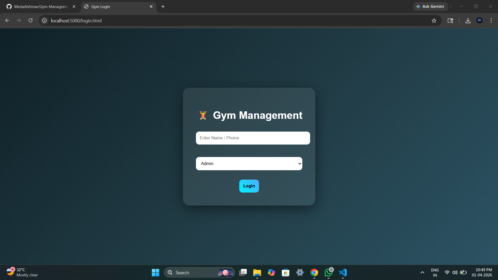
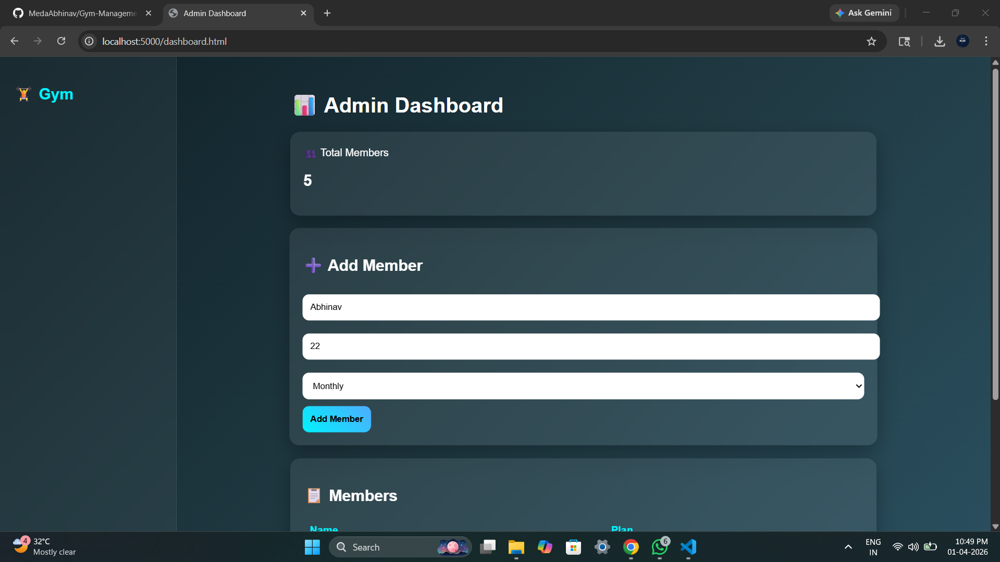
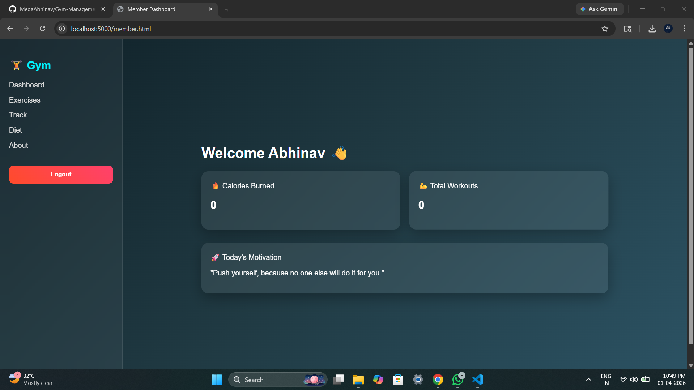
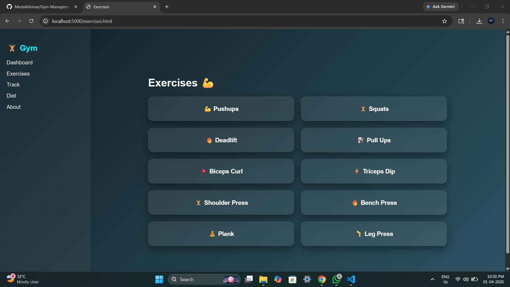
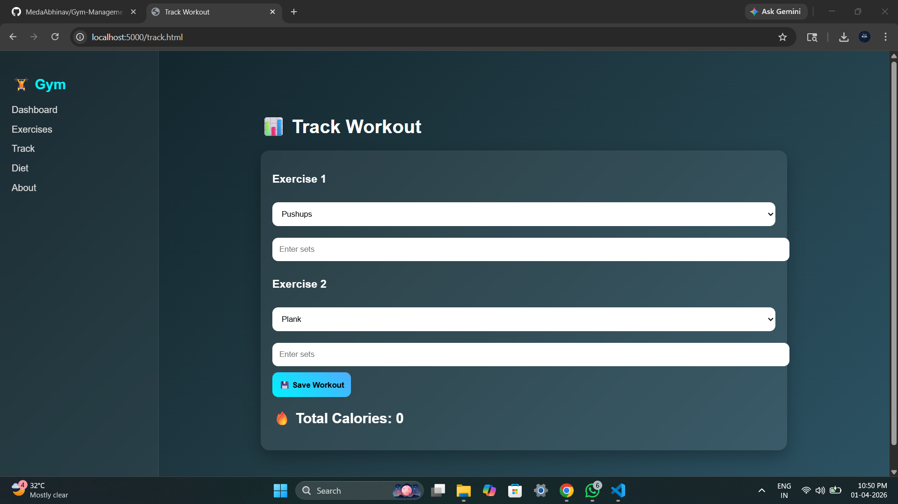
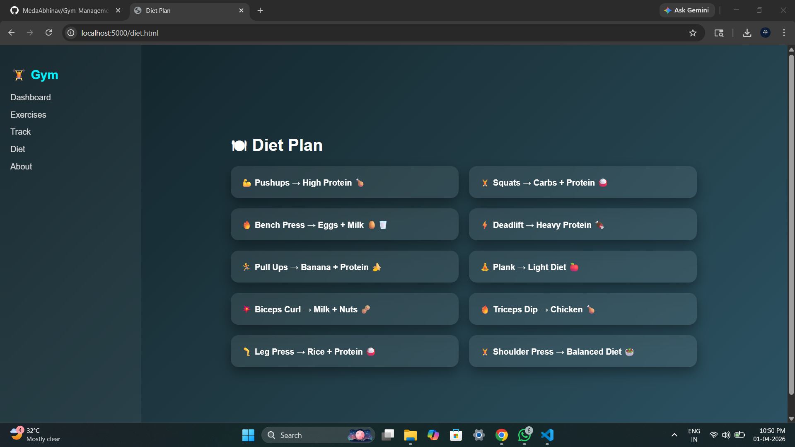
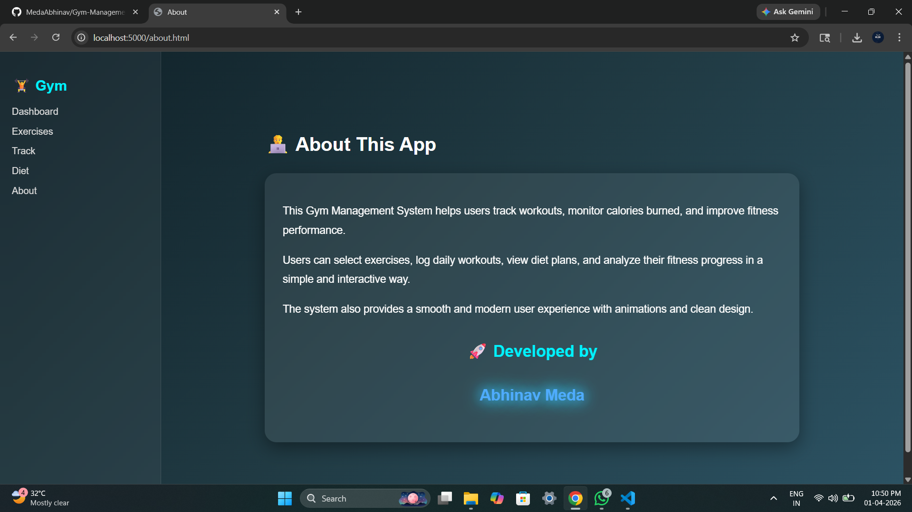

# 🏋️ Gym Management System

A full-stack web application to efficiently manage gym operations, including member management, workout tracking, calorie calculation, and diet planning.

This project uses a modern tech stack with a clean UI and real-time data handling using MongoDB.

---

🚀 Features

👨‍💼 Admin Panel

- Add new gym members
- View all members
- Manage membership plans (Monthly / Yearly)
- Dashboard with total member count

👤 Member Panel

- Login system for members
- Personalized dashboard
- View calories burned
- Track total workouts

💪 Workout Tracking

- Select exercises
- Enter sets
- Automatic calorie calculation
- Data stored per user

🍽️ Diet Plan

- Exercise-based diet suggestions
- Clean UI with interactive effects

---

🛠️ Tech Stack

- Frontend: HTML, CSS, JavaScript
- Backend: Node.js, Express.js
- Database: MongoDB
- API: REST API
- Design: Glassmorphism UI + Animations

---

📸 Screenshots

🔐 Login Page

📊 Admin Dashboard

👤 Member Dashboard

💪 Exercises Page

📝 Track Workout

🍽️ Diet Plan

ℹ️ About Page

---

⚙️ How to Run

1. Clone the repository
   git clone https://github.com/MedaAbhinav/Gym-Management-System.git

2. Navigate to project folder
   cd Gym-Management-System

3. Install dependencies
   npm install

4. Setup MongoDB
   
   - Install MongoDB locally OR use MongoDB Atlas
   - Update connection string in "server.js"

5. Start the server
   node server.js

6. Open in browser
   http://localhost:5000

---

🌟 Key Highlights

- Full-stack application using MERN concepts
- MongoDB-based member storage
- User-specific workout tracking
- Clean UI with animations
- Real-world gym management system

---

👨‍💻 Developed By

Abhinav Meda

---

📌 Future Improvements

- JWT Authentication
- Password-based login system
- Progress charts (graphs)
- Mobile responsive UI
- Payment integration

---
